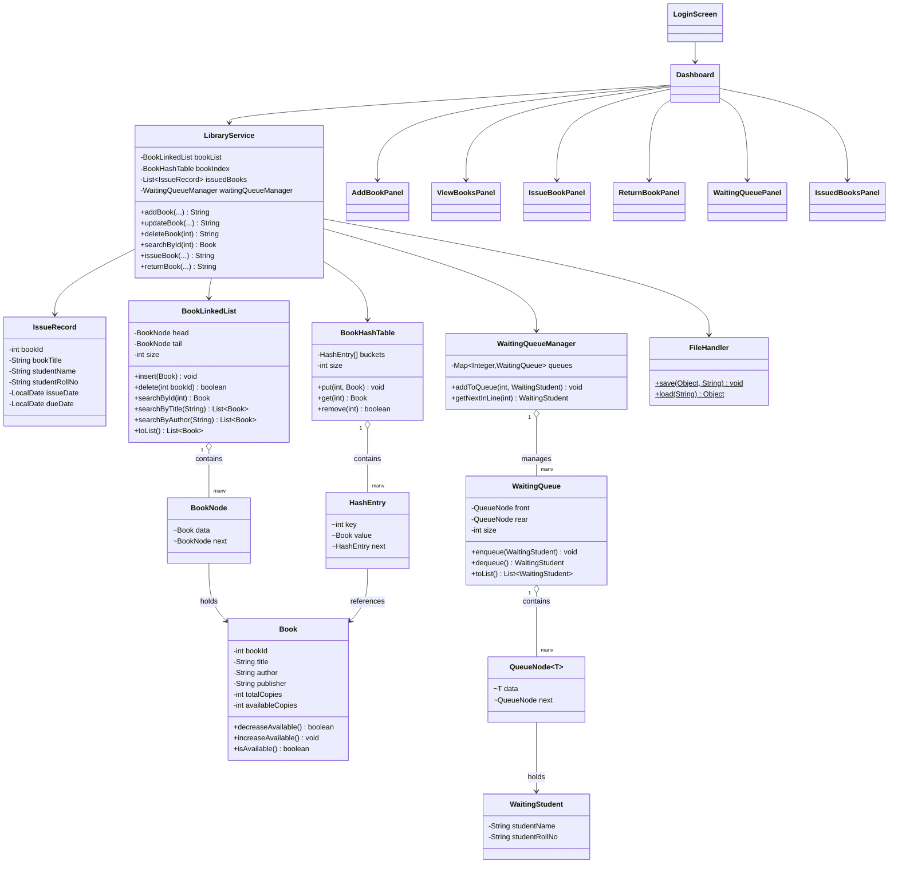

# UML Class Diagram

```mermaid
classDiagram
    class Book {
        -int bookId
        -String title
        -String author
        -String publisher
        -int totalCopies
        -int availableCopies
        +decreaseAvailable() boolean
        +increaseAvailable() void
        +isAvailable() boolean
    }

    class IssueRecord {
        -int bookId
        -String bookTitle
        -String studentName
        -String studentRollNo
        -LocalDate issueDate
        -LocalDate dueDate
    }

    class WaitingStudent {
        -String studentName
        -String studentRollNo
    }

    class BookNode {
        ~Book data
        ~BookNode next
    }

    class BookLinkedList {
        -BookNode head
        -BookNode tail
        -int size
        +insert(Book) void
        +delete(int bookId) boolean
        +searchById(int) Book
        +searchByTitle(String) List~Book~
        +searchByAuthor(String) List~Book~
        +toList() List~Book~
    }

    class HashEntry {
        ~int key
        ~Book value
        ~HashEntry next
    }

    class BookHashTable {
        -HashEntry[] buckets
        -int size
        +put(int, Book) void
        +get(int) Book
        +remove(int) boolean
    }

    class QueueNode~T~ {
        ~T data
        ~QueueNode next
    }

    class WaitingQueue {
        -QueueNode front
        -QueueNode rear
        -int size
        +enqueue(WaitingStudent) void
        +dequeue() WaitingStudent
        +toList() List~WaitingStudent~
    }

    class WaitingQueueManager {
        -Map~Integer,WaitingQueue~ queues
        +addToQueue(int, WaitingStudent) void
        +getNextInLine(int) WaitingStudent
    }

    class FileHandler {
        +save(Object, String)$ void
        +load(String)$ Object
    }

    class LibraryService {
        -BookLinkedList bookList
        -BookHashTable bookIndex
        -List~IssueRecord~ issuedBooks
        -WaitingQueueManager waitingQueueManager
        +addBook(...) String
        +updateBook(...) String
        +deleteBook(int) String
        +searchById(int) Book
        +issueBook(...) String
        +returnBook(...) String
    }

    class Dashboard { }
    class LoginScreen { }
    class AddBookPanel { }
    class ViewBooksPanel { }
    class IssueBookPanel { }
    class ReturnBookPanel { }
    class WaitingQueuePanel { }
    class IssuedBooksPanel { }

    BookLinkedList "1" o-- "many" BookNode : contains
    BookNode --> Book : holds
    BookHashTable "1" o-- "many" HashEntry : contains
    HashEntry --> Book : references
    WaitingQueue "1" o-- "many" QueueNode : contains
    QueueNode --> WaitingStudent : holds
    WaitingQueueManager "1" o-- "many" WaitingQueue : manages
    LibraryService --> BookLinkedList
    LibraryService --> BookHashTable
    LibraryService --> WaitingQueueManager
    LibraryService --> IssueRecord
    LibraryService --> FileHandler
    Dashboard --> LibraryService
    Dashboard --> AddBookPanel
    Dashboard --> ViewBooksPanel
    Dashboard --> IssueBookPanel
    Dashboard --> ReturnBookPanel
    Dashboard --> WaitingQueuePanel
    Dashboard --> IssuedBooksPanel
    LoginScreen --> Dashboard
```

This diagram can be viewed by pasting it into any Mermaid-compatible viewer
(GitHub renders `.md` Mermaid blocks automatically), or at https://mermaid.live
